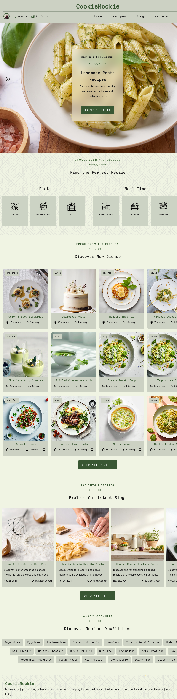
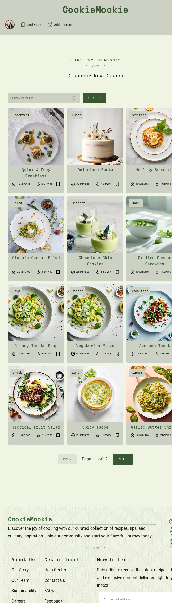
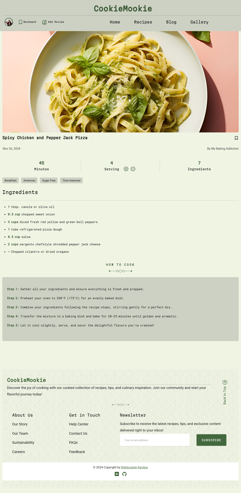

# CookieMookie-Recipe-Website

CookieMookie Recipe Website is a modern web application for discovering and saving your favorite recipes. With features like a profile menu, recipe searching, bookmarking, and a responsive design, this project offers a delightful user experience for food enthusiasts.

## Features

- **Recipe Discovery**: Browse through a variety of recipes with categorized tags.
- **Search Functionality**: Quickly find recipes with a search bar.
- **Responsive Design**: Optimized for all devices.
- **Interactive UI**: Includes sliders, dropdown menus, and hover effects.
- **Dynamic Pagination**: Seamlessly navigate through pages of recipes.

## Technologies Used

- **HTML5 & CSS3**: For the structure and styling of the website.
- **JavaScript (ES6)**: Core logic for interactive features.
- **API Integration**: Fetches recipe data from the Forkify API.
- **Parcel Bundler**: Efficient asset bundling and development server.


## Setup and Usage
1- Clone the repository:

```bash
git@github.com:mahboube89/CookieMookie-Recipe-Website.git
```
2- Navigate to the project directory:

```bash
cd CookieMookie-Recipe-Website
```

3- Install dependencies:
```bash
npm install
```
4- Start the development server(Parcel):
```bash
npm start
```

5- Open your browser and navigate to http://localhost:1234.


## API Integration
The project integrates with the [Forkify API](https://forkify-api.herokuapp.com/v2) to fetch recipe data dynamically.

### Screenshots







## License
This project is licensed under the [MIT License](./LICENSE).  
You are free to use, modify, and distribute this project as long as proper credit is given to the original author.


- Author
Feel free to connect with me for feedback, suggestions, or collaboration opportunities.

- **LinkedIn**: [My LinkedIn Profile](https://linkedin.com/in/mahboubeh-ranjbar-944132239)  
- **GitHub**: [My GitHub Profile](https://github.com/mahboube89)  

If you find this project helpful, don’t forget to give it a ⭐ on GitHub!